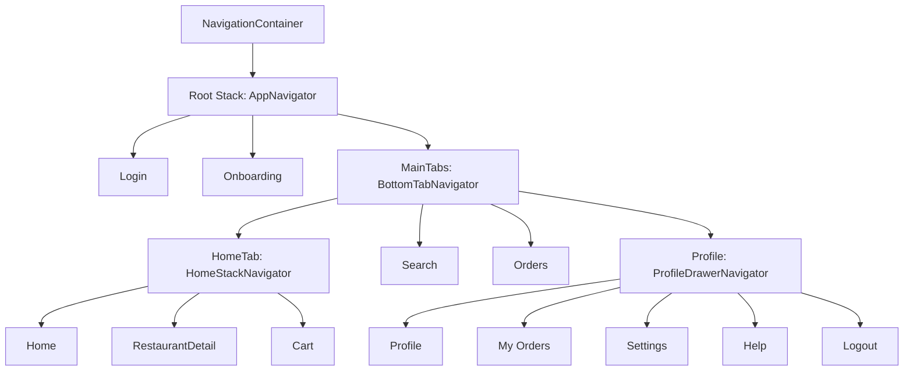

# Food Delivery App (UI Demo)

## Project overview
A simple food delivery UI demo built with Expo + React Native. It includes:

- Auth flow screens (Login, Onboarding)
- Main app tabs (Home, Search, Orders, Profile)
- Home stack screens (Home list, Restaurant details, Cart)
- Profile drawer screens (My Orders, Settings, Help)
- Dummy data-driven UI (restaurants, menu, orders, user profile)

This project is intentionally **UI-first** and uses local mock data (no backend).

## Tech stack
- **Expo**: SDK 55
- **React Native**: 0.83
- **React**: 19
- **TypeScript**
- **React Navigation v7**
  - Native Stack (`@react-navigation/native-stack`)
  - Bottom Tabs (`@react-navigation/bottom-tabs`)
  - Drawer (`@react-navigation/drawer`)
- **UI/Icons**: `@expo/vector-icons` (Ionicons)
- **Storage**: `@react-native-async-storage/async-storage` (installed; use is optional depending on screens)

## How to run locally
### Prerequisites
- Node.js (LTS recommended)
- Bun (recommended for this repo because `bun.lock` is present) OR npm/yarn/pnpm
- Expo Go app (quick testing) or a simulator/device setup
  - iOS: Xcode
  - Android: Android Studio

### Install
```bash
bun install
```

### Start the dev server
```bash
bunx expo start
```

### Run on a platform
```bash
bun run ios
bun run android
bun run web
```

If you prefer npm:
```bash
npm install
npx expo start
```

## Navigation structure
The app is composed of nested navigators:

- Root **Native Stack** (`src/navigation/AppNavigator.tsx`)
  - `Login`
  - `Onboarding`
  - `MainTabs` (Bottom Tabs)

- `MainTabs` **Bottom Tabs** (`src/navigation/BottomTabNavigator.tsx`)
  - `HomeTab` → Home **Native Stack**
  - `Search`
  - `Orders`
  - `Profile` → Profile **Drawer**

- `HomeTab` **Native Stack** (`src/navigation/HomeStackNavigator.tsx`)
  - `Home`
  - `RestaurantDetail`
  - `Cart`

- `Profile` **Drawer** (`src/navigation/ProfileDrawerNavigator.tsx`)
  - `Profile`
  - `My Orders`
  - `Settings`
  - `Help`
  - `Logout` (currently points to `ProfileScreen`)

Notes:
- The tab bar is hidden on `RestaurantDetail` and `Cart` while you’re inside the `HomeTab` stack.

### Diagram


## Deep linking setup
### Current status
Deep linking is **not wired yet** in code:
- `App.tsx` renders `<NavigationContainer>` without a `linking` prop.
- `app.json` does not define an Expo `scheme`.

### Recommended setup (Expo + React Navigation v7)
1) Add a scheme in `app.json`:

```json
{
  "expo": {
    "scheme": "fooddelivery",
    "name": "food-delivery-app",
    "slug": "food-delivery-app"
  }
}
```

2) Add a linking config in `App.tsx`:

```ts
import "react-native-gesture-handler";

import { NavigationContainer } from "@react-navigation/native";
import * as Linking from "expo-linking";

import AppNavigator from "./src/navigation/AppNavigator";

const linking = {
  prefixes: [Linking.createURL("/")],
  config: {
    screens: {
      Login: "login",
      Onboarding: "onboarding",
      MainTabs: {
        screens: {
          HomeTab: {
            screens: {
              Home: "home",
              RestaurantDetail: "restaurant/:id",
              Cart: "cart",
            },
          },
          Search: "search",
          Orders: "orders",
          Profile: {
            screens: {
              Profile: "profile",
              "My Orders": "my-orders",
              Settings: "settings",
              Help: "help",
              Logout: "logout",
            },
          },
        },
      },
    },
  },
} as const;

export default function App() {
  return (
    <NavigationContainer linking={linking}>
      <AppNavigator />
    </NavigationContainer>
  );
}
```

3) Test a link
- In Expo dev server logs, you can open a deep link like `fooddelivery://home`.
- For dev URLs, Expo may use `exp://...` URLs; `Linking.createURL("/")` helps support the current runtime environment.

Important:
- Some route names in this repo include spaces (e.g. `"My Orders"`). The linking config maps these to clean URL paths like `my-orders`.

## Screenshots
There are no app screenshots committed yet (only app icons in `assets/`).

Suggested workflow:
- Add images under `assets/screenshots/` (e.g. `home.png`, `restaurant-detail.png`, `cart.png`, `profile-drawer.png`)
- Then update this section with Markdown image tags.

## Assumptions made
- This is a **UI demo** with mock data in `src/data/dummy.ts` (restaurants, menus, orders, user profile).
- Remote images are loaded from external URLs (requires network access).
- Authentication is not real; the Login screen is a front-end flow.
- The `Logout` drawer item is currently a placeholder route.
- Deep linking instructions above describe a recommended setup; the repo does not currently enable deep linking by default.
